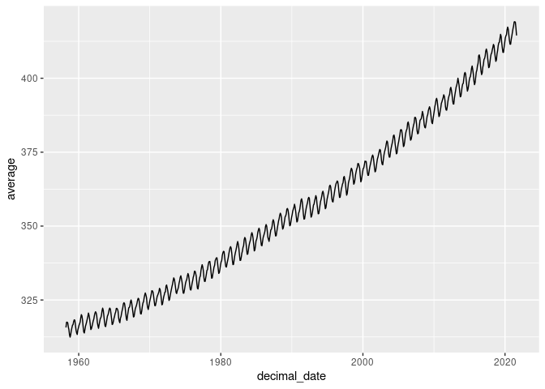
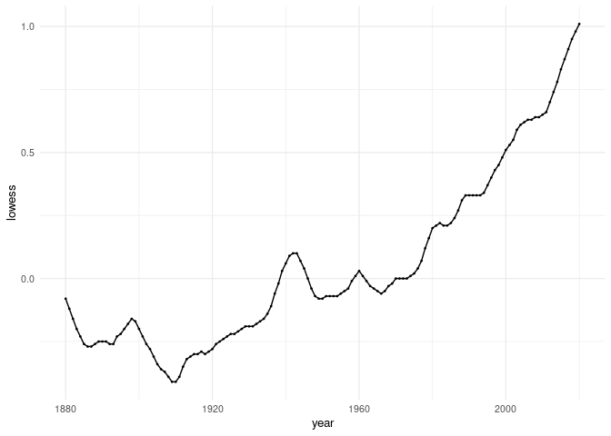
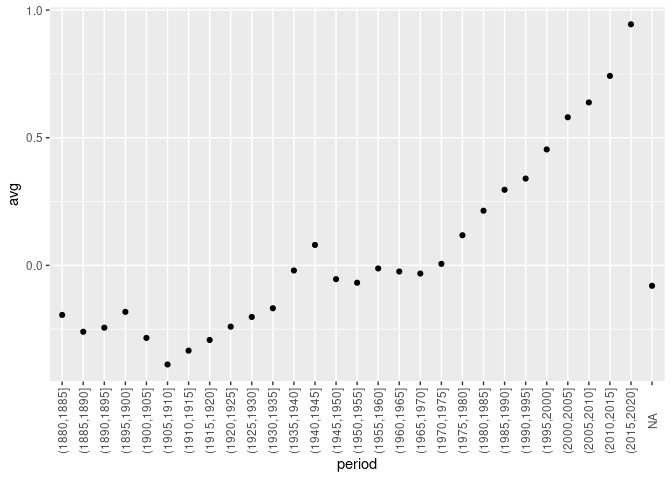
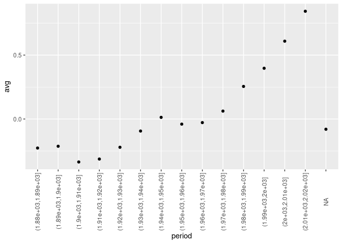
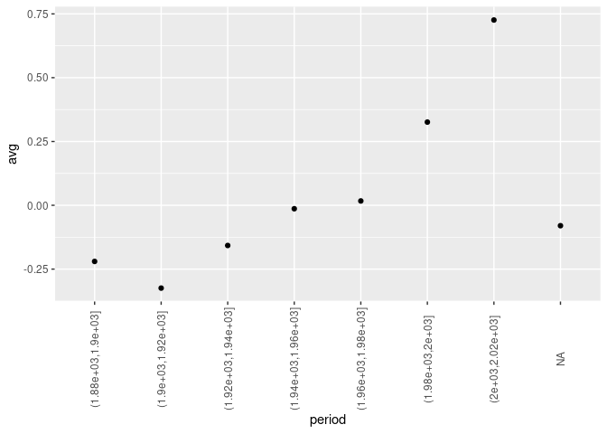
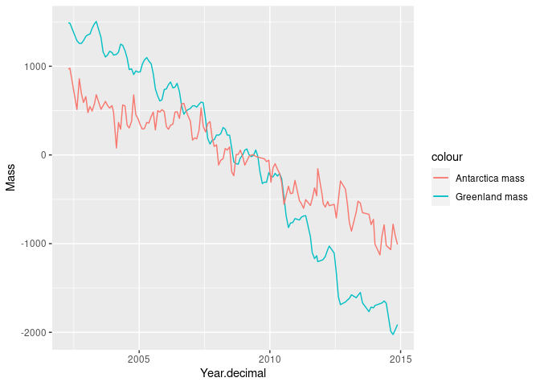
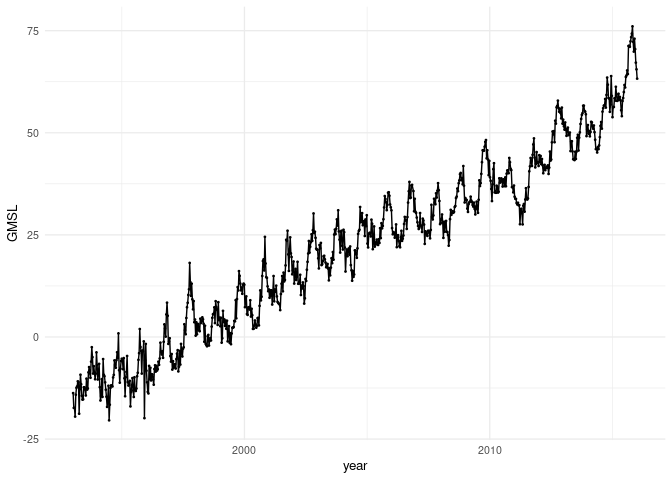
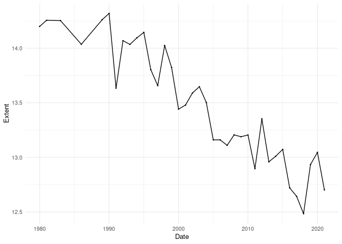

Climate Exercise
================
Kristin Liu

# Unit I: Climate Change Module

## Warm-up exercise: Examining CO2 trends in R

  - Example from <http://climate.nasa.gov/vital-signs/carbon-dioxide/>
  - Raw data from
    <https://gml.noaa.gov/webdata/ccgg/trends/co2/co2_mm_mlo.txt>

<!-- end list -->

``` r
library(tidyverse)
library(dplyr)
library(zoo)
```

``` r
co2 <- 
read_table("https://gml.noaa.gov/webdata/ccgg/trends/co2/co2_mm_mlo.txt", 
                  comment="#",
                  col_names = c("year", "month", "decimal_date", "average",
                                "interpolated", "trend", "days"),
                  na = c("-1", "-99.99"))
```

    ## Warning: 762 parsing failures.
    ## row col  expected    actual                                                          file
    ##   1  -- 7 columns 8 columns 'https://gml.noaa.gov/webdata/ccgg/trends/co2/co2_mm_mlo.txt'
    ##   2  -- 7 columns 8 columns 'https://gml.noaa.gov/webdata/ccgg/trends/co2/co2_mm_mlo.txt'
    ##   3  -- 7 columns 8 columns 'https://gml.noaa.gov/webdata/ccgg/trends/co2/co2_mm_mlo.txt'
    ##   4  -- 7 columns 8 columns 'https://gml.noaa.gov/webdata/ccgg/trends/co2/co2_mm_mlo.txt'
    ##   5  -- 7 columns 8 columns 'https://gml.noaa.gov/webdata/ccgg/trends/co2/co2_mm_mlo.txt'
    ## ... ... ......... ......... .............................................................
    ## See problems(...) for more details.

``` r
co2
```

    ## # A tibble: 762 × 7
    ##     year month decimal_date average interpolated trend  days
    ##    <dbl> <dbl>        <dbl>   <dbl>        <dbl> <dbl> <dbl>
    ##  1  1958     3        1958.    316.         314.    NA -9.99
    ##  2  1958     4        1958.    317.         315.    NA -9.99
    ##  3  1958     5        1958.    318.         315.    NA -9.99
    ##  4  1958     6        1958.    317.         315.    NA -9.99
    ##  5  1958     7        1959.    316.         315.    NA -9.99
    ##  6  1958     8        1959.    315.         316.    NA -9.99
    ##  7  1958     9        1959.    313.         316.    NA -9.99
    ##  8  1958    10        1959.    312.         315.    NA -9.99
    ##  9  1958    11        1959.    313.         315.    NA -9.99
    ## 10  1958    12        1959.    315.         315.    NA -9.99
    ## # … with 752 more rows

``` r
ggplot(co2, aes(x = decimal_date, y = average)) + geom_line() 
```

<!-- -->

The months the CO2 values are at the maximum are in the winter months.
Trees are dormant in the winter, which causes the levels of CO2 to rise
because there are no trees actively photosynthesizing to convert CO2
into oxygen. The months the CO2 values are at the maximum are in the
summer, which is when trees are actively photozynthesizing to convert
CO2 into O2.

The rolling average that is used in computing the trend line is the
average of the maximum and minimum CO2 values for each year. The overall
positive trend indicates that the rolling average has been increasing
since 1960, and that the maximum and minimum CO2 values of each year
have both been increasing.

-----

# Exercise I: Temperature Data

Each of the last years has consecutively set new records on global
climate. In this section we will analyze global mean temperature data.

Data from: <http://climate.nasa.gov/vital-signs/global-temperature>

## Question 1:

In the global temperature change data set, the columns for each data
provide the year, the original mean values of temperature change in
global surface temperatures (in Celcius), and lowess values. Lowess
values are a smoother set of values created from a time series
regression of global surface temperature changes that have been
contaminated with noise.

The measurements are made by record keeping through NASA’s
meteorological stations and ERSST v5, which measures ocean temperatures.
The associated measurement uncertainty arises from systemic biases,
which can be attributed to land cover changes or technology shifts.
There is also inherent measurement uncertainty due to the averaging
method and GISTEMP interpolation, as well as changes in spatial coverage
of the station record.

The method used for measurement is detailed and accurate for data
resolution. The temperature is measured in small intervals of a few
seconds through meteorological stations, and a 5 minute average is taken
from those intervals. The 5 minute averages are aggregated into hourly
averages.

There is no missing data in the dataset. If data is missing, the
significance of the values should be considered as well as the impact
they would have on the existing data. One or two missing points of data
may not affect the overall trend, unless they are extreme outliers. On
the other hand, many points of missing data would leave a significant
gap in the story of global temperature change. This would lead to people
questioning the credibility of the dataset and accuracy of the data.

## Question 2:

Construct the necessary R code to import and prepare for manipulation
the following data set:
<http://climate.nasa.gov/system/internal_resources/details/original/647_Global_Temperature_Data_File.txt>

``` r
globaltemp <- 
read_table("https://climate.nasa.gov/system/internal_resources/details/original/647_Global_Temperature_Data_File.txt",
           skip = 5, comment = "#", col_names = c("year", "no_smoothing", "lowess"), na = "NA")
```

    ## 
    ## ── Column specification ────────────────────────────────────────────────────────
    ## cols(
    ##   year = col_double(),
    ##   no_smoothing = col_double(),
    ##   lowess = col_double()
    ## )

``` r
globaltemp
```

    ## # A tibble: 141 × 3
    ##     year no_smoothing lowess
    ##    <dbl>        <dbl>  <dbl>
    ##  1  1880        -0.16  -0.08
    ##  2  1881        -0.08  -0.12
    ##  3  1882        -0.1   -0.16
    ##  4  1883        -0.16  -0.2 
    ##  5  1884        -0.28  -0.23
    ##  6  1885        -0.33  -0.26
    ##  7  1886        -0.31  -0.27
    ##  8  1887        -0.36  -0.27
    ##  9  1888        -0.17  -0.26
    ## 10  1889        -0.1   -0.25
    ## # … with 131 more rows

## Question 3:

``` r
ggplot(globaltemp, aes(x = year, y = lowess)) + 
  geom_line() + 
  geom_point(size = 0.3) + 
  theme_minimal(base_size = 10)
```

<!-- -->

The overall trend of the global mean temperature has been increasing
from 1880 to 2010, with only some small occasional drops in temperature.
Starting at around 1920, the global mean temperature has been increasing
at a consistent greater rate. This implies that recent human activity
has contributed to the emission of greenhouse gases, which has led to
rapid global warming and the acceleration of global temperature
increase.

## Question 4: Evaluating the evidence for a “Pause” in warming?

The [2013 IPCC
Report](https://www.ipcc.ch/pdf/assessment-report/ar5/wg1/WG1AR5_SummaryVolume_FINAL.pdf)
included a tentative observation of a “much smaller increasing trend” in
global mean temperatures since 1998 than was observed previously. This
led to much discussion in the media about the existence of a “Pause” or
“Hiatus” in global warming rates, as well as much research looking
into where the extra heat could have gone. (Examples discussing this
question include articles in [The
Guardian](http://www.theguardian.com/environment/2015/jun/04/global-warming-hasnt-paused-study-finds),
[BBC News](http://www.bbc.com/news/science-environment-28870988), and
[Wikipedia](https://en.wikipedia.org/wiki/Global_warming_hiatus)).

The IPCC observed that there was a pause in average global temperature
increase between 1998 to 2012. They suggested that there was only an
increase of 0.05 degrees C per decade in those 15 years compared to the
0.12 degree C increase from 1951 to 2012. There are many compelling
arguments and theories that have been published in an attempt to explain
this pause; some explanations include ocean upwellings that have lead to
cooler ocean temperatures or natural rise-and-fall temperature cycles.
However, the time period of the pause described by the IPCC does not
match up with dip in global temperature change from NASA’s data set. The
time period between 1951 and 2012 sees a rather sharp increase in global
temperatures, with some areas of small increase or leveling out of
temperature. The differences between IPCC’s claim and the graph from
NASA’s global average temperature data may be due to measurement
uncertainties.

To better help refine this argument, additional analyses from NASA on
their measurement uncertainties would be helpful in determining the
accuracy of the graph in order to re-compare the data with IPCC’s
claims. Additional data sources on global temperature between 1998 to
2012 and temperature change analysis from the IPCC would also be helpful
in determining if the data supports the claim of a pause in global
warming rates.

## Question 5: Rolling averages

The 5 year average is the average of the temperature over the past 5
years, while annual average is the average temperature over the course
of a year.

``` r
globaltemp5 = globaltemp %>%
  mutate(period = cut(year, seq(1880, 2020, 5), na.pad = TRUE)) %>%
  group_by(period) %>% 
  summarise(avg = mean(lowess)) %>% 
  ggplot(aes(period, avg)) + 
  geom_point() + 
  theme(axis.text.x = element_text(angle = 90, vjust = 0.5))
globaltemp5
```

<!-- -->

``` r
globaltemp10 = globaltemp %>%
  mutate(period = cut(year, seq(1880, 2020, 10), na.pad = TRUE)) %>%
  group_by(period) %>% 
  summarise(avg = mean(lowess)) %>% 
  ggplot(aes(period, avg)) + 
  geom_point() + 
  theme(axis.text.x = element_text(angle = 90, vjust = 0.5))
globaltemp10
```

<!-- -->

``` r
globaltemp20 = globaltemp %>%
  mutate(period = cut(year, seq(1880, 2020, 20), na.pad = TRUE)) %>%
  group_by(period) %>% 
  summarise(avg = mean(lowess)) %>% 
  ggplot(aes(period, avg)) + 
  geom_point() + 
  theme(axis.text.x = element_text(angle = 90, vjust = 0.5))
globaltemp20
```

<!-- -->

In all 3 graphs, the general trends show an increase of global
temperature over the century as well as a steep increase in temperatures
beginning in the 1970s.

# Exercise II: Melting Ice Sheets?

  - Data description: <http://climate.nasa.gov/vital-signs/land-ice/>
  - Raw data file:
    <http://climate.nasa.gov/system/internal_resources/details/original/499_GRN_ANT_mass_changes.csv>

## Question 1:

The columns of the data set are year.decimal (the year and what fraction
of the year has passed), Greenland (Greenland mass measured in
gigatonne), and Antarctica (Antarctica mass measured in gigatonne). The
numbers come from NASA’s GRACE and GRACE Follow-On satellites.

The uncertainty in measurement is liable to change because the data
includes the latest data as well as continuously updated data as more
information is collected. The resolution for the y axis is year and the
resolution for the x-axis is mass in gigatonnes. The interpretation of
the missing values indicates human error or an error with the measuring
equipment.

## Question 2:

``` r
ice_sheets <- 
read_csv("499_GRN_ANT_mass_changes.csv", comment = "#", 
         col_names = c("Year.decimal", "Greenland", "Antarctica"), skip = 1, na = "NA")
```

    ## Rows: 140 Columns: 3

    ## ── Column specification ────────────────────────────────────────────────────────
    ## Delimiter: ","
    ## dbl (3): Year.decimal, Greenland, Antarctica

    ## 
    ## ℹ Use `spec()` to retrieve the full column specification for this data.
    ## ℹ Specify the column types or set `show_col_types = FALSE` to quiet this message.

``` r
ice_sheets
```

    ## # A tibble: 140 × 3
    ##    Year.decimal Greenland Antarctica
    ##           <dbl>     <dbl>      <dbl>
    ##  1        2002.     1491.       967.
    ##  2        2002.     1486.       979.
    ##  3        2003.     1287.       512.
    ##  4        2003.     1258.       859.
    ##  5        2003.     1257.       694.
    ##  6        2003.     1288.       592.
    ##  7        2003.     1337.       658.
    ##  8        2003.     1354.       477.
    ##  9        2003.     1363.       546.
    ## 10        2003.     1427.       494.
    ## # … with 130 more rows

## Question 3:

``` r
ggplot(ice_sheets, aes(x = Year.decimal, Mass)) + 
  geom_line(aes(y = Greenland, color = "Greenland mass")) + 
  geom_line(aes(y = Antarctica, color = "Antarctica mass"))
```

<!-- -->

# Exercise III: Rising Sea Levels?

  - Data description: <http://climate.nasa.gov/vital-signs/sea-level/>
  - Raw data file:
    <http://climate.nasa.gov/system/internal_resources/details/original/121_Global_Sea_Level_Data_File.txt>

## Question 1:

The data set contains the columns: altimeter type 0=dual-frequency
999=single frequency (ie Poseidon-1), merged file cycle \# ,
year+fraction of year (mid-cycle), number of observations, number of
weighted observations, GMSL (Global Isostatic Adjustment (GIA) not
applied) variation (mm) with respect to TOPEX collinear mean reference,
standard deviation of GMSL (GIA not applied) variation estimate (mm),
smoothed (60-day Gaussian type filter) GMSL (GIA not applied) variation
(mm), MSL (Global Isostatic Adjustment (GIA) applied) variation (mm)
with respect to TOPEX collinear mean reference, standard deviation of
GMSL (GIA applied) variation estimate (mm), smoothed (60-day Gaussian
type filter) GMSL (GIA applied) variation (mm), and smoothed (60-day
Gaussian type filter) GMSL (GIA applied) variation (mm) (annual and
semi-annual signal removed).

The data comes from the Integrated Multi-Mission Ocean Altimeter Data
for Climate Research
(<http://podaac.jpl.nasa.gov/dataset/MERGED_TP_J1_OSTM_OST_ALL_V2>). The
data set consists of sea surface heights combined with common
terrestrial reference frames, which is then placed onto a geo-referenced
orbit.

There is more uncertainty in this data set due to the time taken in
processing the data. The resolution for the x axis is year and the
resolution for the y axis is GMSL (global isostatic adjustment)
variation (mm) with respect to TOPEX colinear mean reference. There is
no missing data, but if there were missing values they could be
interpreted as human error, measurement equipment error, or inability to
collect data for a particular timepoint.

## Question 2:

``` r
sea_levels <- read_table("http://climate.nasa.gov/system/internal_resources/details/original/121_Global_Sea_Level_Data_File.txt", skip = 46, col_names = c("altimeter type (0=dual, 999=single)","merged file cycle number", "year", "number of observations", "number of weighted observations", "GMSL", "Standard deviation of GMSL", "GMSL (GIA applied)", "standard deviation of GMSL (GIA applied)", "Smoothed GMSL GIA applied variation", "Smoothed GMSL GIA applied variation (annual, semiannual signal removed)"), comment="#")
```

    ## 
    ## ── Column specification ────────────────────────────────────────────────────────
    ## cols(
    ##   `altimeter type (0=dual, 999=single)` = col_double(),
    ##   `merged file cycle number` = col_double(),
    ##   year = col_double(),
    ##   `number of observations` = col_double(),
    ##   `number of weighted observations` = col_double(),
    ##   GMSL = col_double(),
    ##   `Standard deviation of GMSL` = col_double(),
    ##   `GMSL (GIA applied)` = col_double(),
    ##   `standard deviation of GMSL (GIA applied)` = col_double(),
    ##   `Smoothed GMSL GIA applied variation` = col_double(),
    ##   `Smoothed GMSL GIA applied variation (annual, semiannual signal removed)` = col_double()
    ## )

    ## Warning: 847 parsing failures.
    ## row col   expected     actual                                                                                                    file
    ##   1  -- 11 columns 12 columns 'http://climate.nasa.gov/system/internal_resources/details/original/121_Global_Sea_Level_Data_File.txt'
    ##   2  -- 11 columns 12 columns 'http://climate.nasa.gov/system/internal_resources/details/original/121_Global_Sea_Level_Data_File.txt'
    ##   3  -- 11 columns 12 columns 'http://climate.nasa.gov/system/internal_resources/details/original/121_Global_Sea_Level_Data_File.txt'
    ##   4  -- 11 columns 12 columns 'http://climate.nasa.gov/system/internal_resources/details/original/121_Global_Sea_Level_Data_File.txt'
    ##   5  -- 11 columns 12 columns 'http://climate.nasa.gov/system/internal_resources/details/original/121_Global_Sea_Level_Data_File.txt'
    ## ... ... .......... .......... .......................................................................................................
    ## See problems(...) for more details.

``` r
sea_levels
```

    ## # A tibble: 847 × 11
    ##    `altimeter type (… `merged file cyc…  year `number of obse… `number of weigh…
    ##                 <dbl>             <dbl> <dbl>            <dbl>             <dbl>
    ##  1                  0                11 1993.           463892           336485.
    ##  2                  0                12 1993.           458154           333208.
    ##  3                  0                13 1993.           469524           341593.
    ##  4                  0                14 1993.           419112           305335.
    ##  5                  0                15 1993.           456793           330244.
    ##  6                  0                16 1993.           414055           299600.
    ##  7                  0                17 1993.           465235           336243.
    ##  8                  0                18 1993.           463257           334575.
    ##  9                  0                19 1993.           458542           330751.
    ## 10                999                20 1993.           464921           339267.
    ## # … with 837 more rows, and 6 more variables: GMSL <dbl>,
    ## #   Standard deviation of GMSL <dbl>, GMSL (GIA applied) <dbl>,
    ## #   standard deviation of GMSL (GIA applied) <dbl>,
    ## #   Smoothed GMSL GIA applied variation <dbl>,
    ## #   Smoothed GMSL GIA applied variation (annual, semiannual signal removed) <dbl>

## Question 3:

``` r
ggplot(sea_levels, aes(x = year, y = GMSL)) + 
  geom_line() + 
  geom_point(size = 0.3) + 
  theme_minimal(base_size = 10) 
```

<!-- -->

The graph shows that the global mean sea level been increasing between
1993 to 2016. There are slight fluctuations in sea level within each
year, likely due to seasonal changes. The steady positive trend implies
that global sea levels are rising as a result of global warming.

# Exercise IV: Arctic Sea Ice?

  - <http://nsidc.org/data/G02135>
  - <ftp://sidads.colorado.edu/DATASETS/NOAA/G02135/north/daily/data/N_seaice_extent_daily_v3.0.csv>

## Question 1:

The data set contains the columns: year, month, day, dissing, extent,
and source data. Missing shows whether or not the data is absent with
either a 0 (no) or 1 (yes). Extent refers to sea ice extent, which is
the area of ocean where there is at least some sea ice measured in 10^6
sq km. Source data shows the source for where all the data was gathered.

The data comes from the National Snow and Ice Data Center
(<https://nsidc.org/data/G02135>). Changes in Arctic and Antarctic sea
ice can be searched through the sea ice index which provides the latest
sea ice extent and data values.

There is not much uncertainty in this data set because the data is
produced consistently, which makes the index time-series usable in terms
of looking at long-term trends. Daily and monthly measurements are made,
but monthly measurements are more reliable for long-term analyses
because daily measurements may vary due to short term weather effects.
The resolution of the x axis is the date and the resolution of y axis is
the extent (in 10^6 sq km). There are no missing values, but is there
were they would likely be due to human error or measurement error.

## Question 2:

``` r
sea_ice <- read_csv("N_seaice_extent_daily_v3.0.csv", col_names = c("Year", "Month", 
                                                                    "Day", "Extent", 
                                                                    "Missing", "Source Data"), 
                    skip = 2, na = "NA")
```

    ## Rows: 14023 Columns: 6

    ## ── Column specification ────────────────────────────────────────────────────────
    ## Delimiter: ","
    ## chr (3): Month, Day, Source Data
    ## dbl (3): Year, Extent, Missing

    ## 
    ## ℹ Use `spec()` to retrieve the full column specification for this data.
    ## ℹ Specify the column types or set `show_col_types = FALSE` to quiet this message.

``` r
sea_ice <- sea_ice %>% 
  mutate(Date = as.Date(paste(Year, Month, Day, sep = "-"))) %>%
  select(Date, Year, Month, Day, Extent, Missing)
sea_ice
```

    ## # A tibble: 14,023 × 6
    ##    Date        Year Month Day   Extent Missing
    ##    <date>     <dbl> <chr> <chr>  <dbl>   <dbl>
    ##  1 1978-10-26  1978 10    26      10.2       0
    ##  2 1978-10-28  1978 10    28      10.4       0
    ##  3 1978-10-30  1978 10    30      10.6       0
    ##  4 1978-11-01  1978 11    01      10.7       0
    ##  5 1978-11-03  1978 11    03      10.8       0
    ##  6 1978-11-05  1978 11    05      11.0       0
    ##  7 1978-11-07  1978 11    07      11.1       0
    ##  8 1978-11-09  1978 11    09      11.2       0
    ##  9 1978-11-11  1978 11    11      11.3       0
    ## 10 1978-11-13  1978 11    13      11.5       0
    ## # … with 14,013 more rows

## Question 3:

``` r
sea_ice_filter <- sea_ice %>%
  filter(Month == "01", Day == "01")
ggplot(sea_ice_filter, aes(x = Date, y = Extent)) + 
  geom_line() + 
  geom_point(size = 0.3) + 
  theme_minimal(base_size = 10) 
```

<!-- -->

There has been an overall decrease in sea ice extent from 1978 to
present day. Annual fluctuations are due to seasonal changes, as
logically there would be less sea ice in the summer and more sea ice in
the winter. However, there is a negative linear association between the
years and sea ice extent. From this trend, we can infer that sea ice is
melting as a result of global warming.
